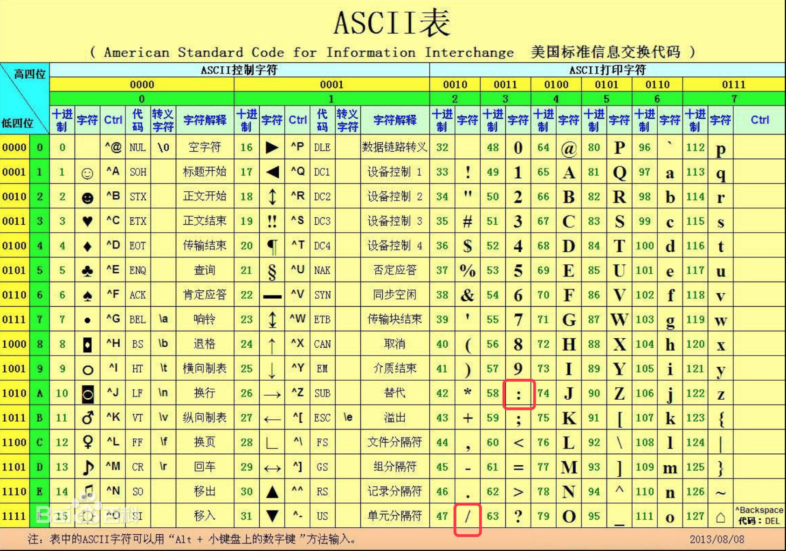

# 基于Redis有序集合实现百万级号码快速查询

摘要：500万数字字符串查询，使用传统的MySQL模糊查询方法，需要1000多毫秒。使用Redis实现，只需要几毫秒，数百倍的性能提升！希望通过这个列子，来感受Redis强大快速的数据搜索能力。

假如运营商需要提供选号功能，用户只需要填写数字前n位，就能自动补全余下的号码。形如：

当数据达到百万级千万级的时候，搜索将会相当费时。我们将设计一个实验去模拟这个场景。

### 实验机器

* OS ubuntu 15.04

* Memory 7.7GiB

* Processor Intel(R) Core(TM) i3-4160 CPU @ 3.60GHz * 4

* OS type 64-bit

* DISK INTEL SSDSC2BW120H6, 113.9GB

### 生成实验数据

MySQL数据表：

	async function init() {
	  let start_time = new Date().getTime();
	  //生成100万条数据
	  for (let i = 0; i < 1000000; i++) {
	    console.log(i)
	    //生成11位随机数字
	    let phonenum = randomStr(11);
	    //将数字存储到Redis
	    await redisClient.zaddAsync('phone', 0, phonenum);
	    //将数字存储到MySQL
	    let sql = 'insert into phone (phone) values (?)';
	    let args = [phonenum];
	    await connection.queryAsync(sql, args);
	  }
	  let end_time = new Date().getTime();
	  //打印实验信息
	  console.log('Init Finish')
	  console.log('Start..' + start_time);
	  console.log('End..' + end_time);
	  console.log('Use_time .. ' + (end_time - start_time));
	}

注：串行地插入实验数据效率并不高，笔者实验过程，单进程插入百万数据用时约3小时28分，4进程插入共400万数据用时约6小时06分。

### MySQL实现模糊查询

MySQL利用like关键字实现模糊查找：

    let sql = 'select phone from phone where phone like (?)';
    let args = [searchkey + '%'];
    let rs = await connection.queryAsync(sql, args);
    return rs;

### Redis实现模糊查询

实现原理：

Redis 有序集合由key,score,value组成。当所有成员分值都相同的时候，有序集合将根据成员的名字进行排序，而当所有成员的分值都是0的时候，成员将按照字符串的二进制顺序进行排序。查看ASCII码表可知，排在数字0～9前后的字符是 '/' 和 ':'

设有数字集合

	...
	
	12821361
	
	18811361
	
	18821362
	
	19821361
	
	...
	
如果往有序集合插入 '18/' 和 '18:', 并设置分值为0，根据上面提到sortedset的排序规则，'18/'字符一定会在18821361前面，'18:'一定会在18821362后面，像这样：

	...
	
	12821361
	
	18/
	
	18811361
	
	18821362
	
	18:
	
	19821361
	
	...

也就是说，如果想要搜索18开头的字符串，只需要获取 '18/' 和 '18:' 之间的字符串即可。通过 Redis 的 zrank 方法分别查询这两个字符的位置，再通过 zrange 方法获取他们之间的字符串集合，就可以得到我们想要的结果。

实现代码：
	
	//构建前后缀
	let prefix = `${searchkey}/`;
  	let suffix = `${searchkey}:`;

  	await redisClient.zaddAsync('phone', 0, prefix);
	await redisClient.zaddAsync('phone', 0, suffix);

    //插入辅助字符串
    let prefixRank = await redisClient.zrankAsync('phone', prefix);
    let sufffixRank = await redisClient.zrankAsync('phone', suffix);

	//只查询前缀和后缀之间的代码，忽略手动插入那部分代码
    let start = prefixRank + 1;
    let end = sufffixRank - 1;

    //获取查询结果
    let rs = await redisClient.zrangeAsync('phone', start, end);
    
    //移除辅助字符串
    let remprefix = await redisClient.zremAsync('phone', prefix);
    let remsuffix = await redisClient.zremAsync('phone', suffix);

    return rs;
    
### 性能比较

随机生成4位随机数字字符串，分别用Redis和MySQL进行查询

实现代码

    for (let i = 0; i < TEST_COUNT; i++) {
       //生成4位随机数字字符串
	    let test_str = randomStr(4);
	
	    let start_time = new Date().getTime();
	    //Redis搜索
	    let rs = await redisSearch(test_str);
	    let end_time = new Date().getTime();
	    console.log('RedisResult##################################');
	    console.log('use_time .. ' + (end_time - start_time));
	
	    let mysql_start_time = new Date().getTime();
	    //MySQL搜索
	    let mysql_rs = await mysqlSearch(test_str)
	    let mysql_end_time = new Date().getTime();
	    console.log('MySQLResult##################################');
	    console.log('use_time .. ' + (mysql_end_time - mysql_start_time));
    }

100w数据用时

|次数 / 用时|1|2|3|4|5|6|7|8|9|10|
|---|---|---|---|---|---|---|---|---|---|---|
|MySQL|190|177|175|175|175|176|173|176|173|174
|Redis|14|0|0|1|1|3|1|1|3|2

500w数据用时

查询10次，单位毫秒

|次数 / 用时|1|2|3|4|5|6|7|8|9|10|
|---|---|---|---|---|---|---|---|---|---|---|
|MySQL|1052|1084|1089|1087|1069|1031|1034|1096|1061|1096
|Redis|17|1|2|1|1|1|3|3|6|9

注：每次跑脚本Redis的第一次查询耗时都特别久，如图第一次用时17毫秒，其他查找耗时没有超过10毫秒，未能确定是Redis的原因还是Node客户端的原因。

可见，使用Redis实现此查询，获得了令人振奋的性能提升！

### Github地址

[https://github.com/zcmyworld/number-search](https://github.com/zcmyworld/number-search)

运行方式：

脚本: npm install & node app.js

UI: npm install & node server.js  访问 http://127.0.0.1:3003/page/index

